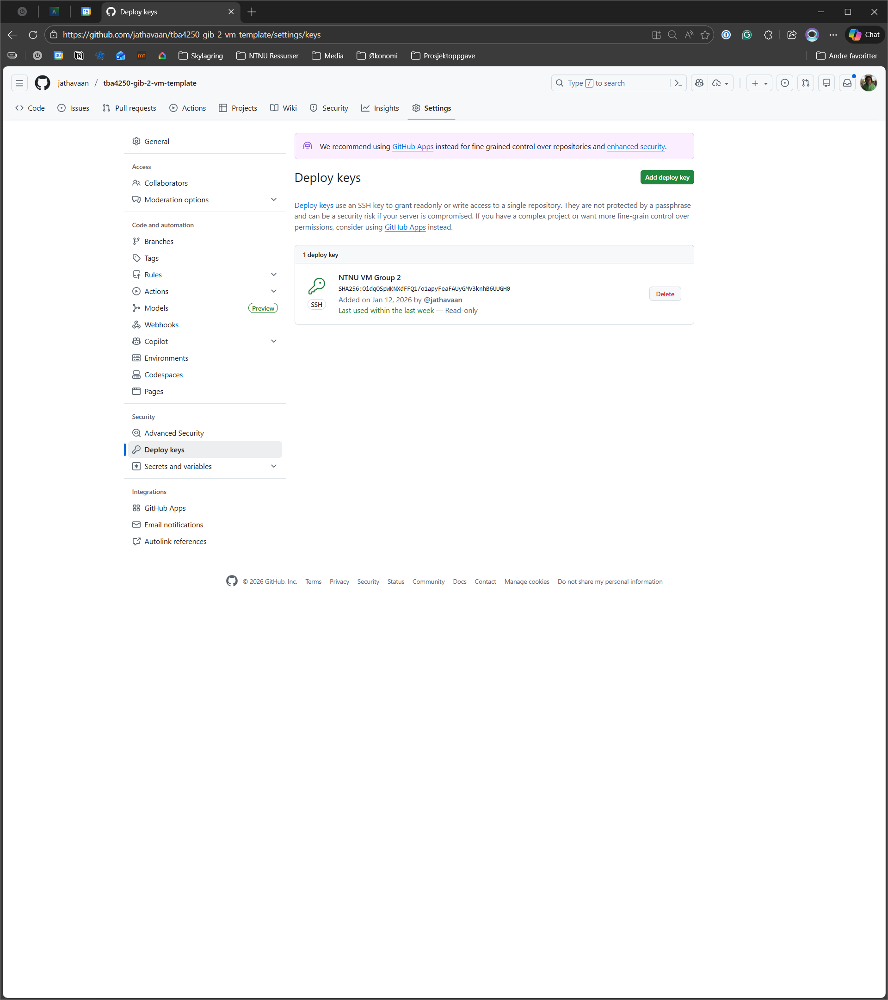

## VM template repository

> [!NOTE]
> Configure the NTNU Virtual Machine before you start with this.
> The [documentation](https://github.com/jathavaan/tba4250-gib-2-template/blob/main/.github/docs/VIRTUAL_MACHINE.md)
> covers all steps that are needed up until this point. This guide is not intended to be used on the repository with
> your source code. Create a new repository and use this repository as a template.

This repository is to be cloned on the NTNU virtual machine, and should only pull the images defined in the [
`docker-compose.yml`](./docker-compose.yml). To make it work a few things have to be configured.

### Clone the repository locally

Clone the repository on your local machine with the command

```powershell
git clone https://github.com/jathavaan/tba4250-gib-2-vm-template.git # Change the url to match your repository
```

### Update Docker username

Currently, my username, `jathavaan`, is set in the image paths in the compose file. Simply swap `jathavaan` with your
username. Select the username that was set as `DOCKER_USERNAME` in
the [automated deployments documentation](https://github.com/jathavaan/tba4250-gib-2-template/blob/main/.github/docs/CI-CD.md).
Commit and push the changes.

### Add SSH deploy key to GitHub repository

In the VM deployment repository a SSH key have to be added. Select *Settings* in the repository menubar and navigate to
*Deploy keys* under the *Security* tab. Create *Add deploy key*.

<div style="display:flex; justify-content:center;">
    
</div>

On the VM run the following command to view the SSH key

```powershell
sudo cat /root/.ssh/id_ed25519.pub
```

And paste it in the *Key* textbox. Give it a descriptive name. This gives the VM permission to pull the code from the
GitHub repository, and no team member have to log in to GitHub on the VM.

### Clone the repository on the VM

Navigate to the directory `/srv/` with `cd /srv/` and clone the repository there using SSH. Use the following command

```powershell
sudo git clone git@github.com:jathavaan/tba4250-gib-2-vm-template.git # Change the repository URL to your URL
```

### Create env-file

In the project root add the file `.env`. This should include the following:

```dotenv
POSTGRES_DB=templatedb
POSTGRES_USER=app
POSTGRES_PASSWORD=my-secret-password-123
POSTGRES_HOST=db
POSTGRES_PORT=5432
```

The env-file is not pushed to Git and have to be added manually on the VM.

### Pull the images

> [!NOTE]
> After the initial setup these are the only commands needed to deploy the app whenever new code is published

Navigate to the repository root whenever you want to redeploy the system and run the following commands

```powershell
sudo git pull
```

And to pull the latest images and rebuild

```powershell
sudo podman-compose up pull
sudo podman-compose up -d
```

> [!WARNING]
> Some tutorials may tell you to run `sudo podman-compose down -v`, and this is fine, but it is important that you know
> that the database and the data stored with it will be deleted. 